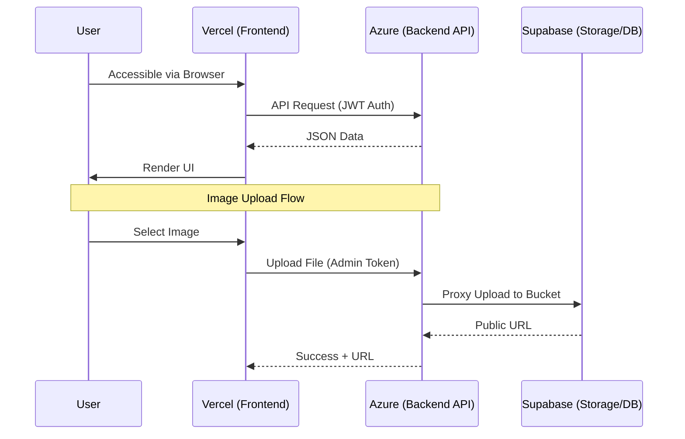

# EventTix Frontend 🎟️

A premium, modern Event Booking and Management platform built with **React** and **Vite**. EventTix provides a sleek user interface for discovering events, managing ticket purchases, and organizing events for administrators.

---

## 🔄 Application Data Flow



---

## 🛠️ Tech Stack
- **Framework**: [React 19](https://react.dev/)
- **Build Tool**: [Vite 8](https://vitejs.dev/)
- **Styling**: [Tailwind CSS](https://tailwindcss.com/) & [Shadcn/UI](https://ui.shadcn.com/)
- **Data Fetching**: [TanStack Query v5](https://tanstack.com/query/latest)
- **State Management**: [Redux Toolkit](https://redux-toolkit.js.org/)
- **Maps**: [Leaflet](https://leafletjs.com/)
- **Components**: Radix UI primitives & Lucide icons

---

## 🚀 Key Features
- **Dynamic Event Discovery**: Interactive event lists with search and category filtering.
- **Secure Ticketing**: Multi-tier ticket selection and QR code generation for tickets.
- **Admin Dashboard**: Comprehensive dashboard for event creators to manage venues and sales.
- **Image Uploads**: Integrated image management via a secure backend proxy.
- **Responsive Design**: Mobile-first approach for seamless booking on any device.

---

## ⚙️ Getting Started

### 1. Installation
Clone the repository and install dependencies:
```bash
npm install
```

### 2. Configuration (`.env`)
Create a `.env` file in the root directory and add the following variables:

| Variable | Description |
| :--- | :--- |
| `VITE_BACKEND_API` | The base URL of your .NET API (e.g., `https://api.yourdomain.com/api`). |
| `VITE_SUPABASE_URL` | Your Supabase project URL (used for public asset resolution). |
| `VITE_SUPABASE_ANON_KEY` | Your Supabase anonymous key. |

### 3. Running Locally
```bash
npm run dev
```
The application will be available at `http://localhost:3000`.

---

## 🔐 Deployment (Vercel)

### Building for Production
Vite bakes environment variables into the bundle at build time. Ensure your environment variables are configured in the Vercel Dashboard before deployment.

1.  Push your code to GitHub.
2.  Connect your repository to **Vercel**.
3.  Add the `VITE_` variables in **Settings > Environment Variables**.
4.  Vercel will automatically build and deploy the production bundle.

---

## ⚠️ Things to Watch Out For

> [!WARNING]
> - **CORS**: Ensure your Vercel deployment URL is added to the backend's allowed origins list.
> - **Environment Prefixes**: All variables must start with `VITE_` to be accessible in the client-side code.
> - **Build Cache**: If you update environment variables in Vercel, you must trigger a **Redeploy** to bake the new values into the JS files.

---

## 🖌️ Design System
This project uses **Shadcn/UI** for a consistent and premium look. 
- Use `npm run format` to ensure code style consistency with Prettier.
- Theme colors and tokens are managed in `index.css`.
